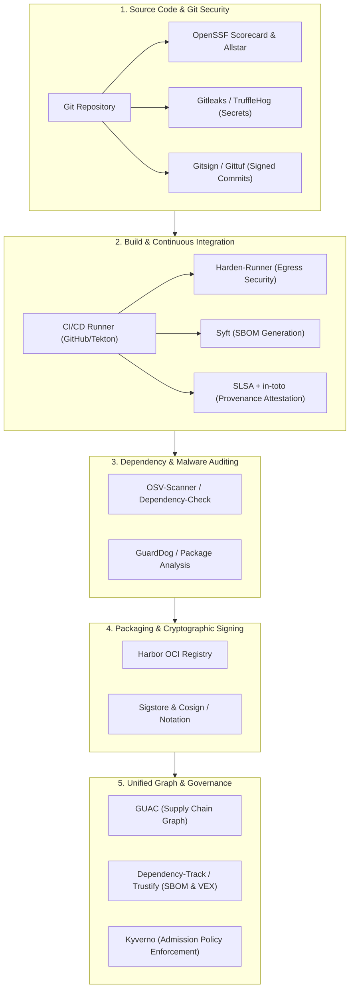

# 🛡️ Awesome Supply Chain Security Platform

### 🚀 The Definitive Directory of Software Supply Chain Security (SSCS), SCA, SBOM, Provenance & DevSecOps Tools

     

  <b>A curated catalog of enterprise SaaS platforms and leading open-source projects focused on Software Supply Chain Security, Software Composition Analysis (SCA), SBOM generation & management, SLSA build provenance, cryptographic signing, secret leak detection, and malicious package mitigation.</b>

  📅 Last updated: August 2026 | Maintained with ❤️ by the DevSecOps Community

---

## 📑 Table of Contents

- [🌟 Overview & SEO Taxonomy](#-overview--seo-taxonomy)
- [🏢 Enterprise SaaS & Hosted Platforms](#-enterprise-saashosted-platforms)
- [🔓 Open-Source GitHub Projects (Ranked by Stars ⭐)](#-open-source-github-projects-ranked-by-stars-)
  - [📦 Artifact, Vulnerability & Container Scanning](#-artifact-vulnerability--container-scanning)
  - [🔑 Secrets Detection & Git Protection](#-secrets-detection--git-protection)
  - [📋 SBOM Generation, Ingestion & Analysis](#-sbom-generation-ingestion--analysis)
  - [✍️ Cryptographic Signing & SLSA Provenance](#️-cryptographic-signing--slsa-provenance)
  - [🔍 Malicious Package Analysis & Malware Defense](#-malicious-package-analysis--malware-defense)
  - [🕸️ Security Posture, Policy & Supply Chain Graphs](#️-security-posture-policy--supply-chain-graphs)
- [🧱 Open-Source Building Blocks Architecture](#-open-source-building-blocks-architecture)
- [⚖️ Commercial SaaS vs. Open-Source Stack](#️-commercial-saas-vs-open-source-stack)
- [🎯 Key Evaluation Capabilities Checklist](#-key-evaluation-capabilities-checklist)
- [⭐ Star History](#-star-history)
- [🤝 How to Contribute](#-how-to-contribute)
- [📜 License & Disclaimer](#-license--disclaimer)

---

## 🌟 Overview & SEO Taxonomy

Modern software engineering relies on thousands of direct and transitive third-party dependencies, complex CI/CD automation pipelines, multi-stage container builds, and distributed artifact repositories. This expanded attack surface has made **Software Supply Chain Security (SSCS)** a mission-critical domain for DevSecOps teams, CISOs, platform architects, and open-source maintainers.

### 🔑 Primary Focus Areas & Keywords:
- **Software Composition Analysis (SCA):** Automated detection of known vulnerabilities (CVEs) and open-source license compliance tracking across package ecosystems (npm, PyPI, Maven, Go, Cargo, NuGet, RubyGems).
- **Software Bill of Materials (SBOM):** Standardized artifact inventory generation, sharing, and continuous vulnerability correlation using **CycloneDX**, **SPDX**, and **OpenVEX** formats.
- **Build Provenance & Supply-Chain Levels for Software Artifacts (SLSA):** Non-forgeable cryptographic attestations (via **in-toto** and **Sigstore**) guaranteeing source-to-binary build integrity.
- **Cryptographic Artifact Signing:** Keyless identity-based signing and transparent verification using **Sigstore Cosign**, **Notation**, and **Gitsign**.
- **Malicious Dependency & Malware Detection:** Heuristic, behavioral, and sandbox analysis detecting typosquatting, dependency confusion, install script execution, and backdoor injection.
- **Application Security Posture Management (ASPM):** Pipeline attack path analysis, Pipeline-Bill-of-Materials (PBOM), and unified risk scoring.
- **Secret & Token Leak Protection:** High-speed regex and entropy scanning with real-time push protection.

---

## 🏢 Enterprise SaaS/Hosted Platforms

> 📊 **Market Size & Sector Dynamics:**  
> The global Software Supply Chain Security market is estimated at **$3.2B–$4.5B in 2026** (projected to exceed **$11.8B+ by 2032** growing at a **~24–28% CAGR**). The market is currently **moderately fragmented**—evolving from discrete point tools (SCA scanners, secrets detection, container signing) toward consolidated ASPM (Application Security Posture Management) and end-to-end software factory platforms. While tech hyperscalers (Microsoft, Alphabet/Google, AWS) and large cybersecurity firms hold substantial market share, no single vendor commands a winner-take-all monopoly.

*Sorted in descending order by Company Scale (Valuation / Revenue).*

| 🏢 Platform | 🏷️ Focus & Description | 💰 Starting Pricing | 🎁 Free Tier / Free Trial Limits | 📈 Company Scale (Valuation / Revenue) |
| :--- | :--- | :--- | :--- | :--- |
| **[Microsoft / Azure Defender for DevOps](https://azure.microsoft.com/en-us/products/defender-for-cloud/)** | Cloud-native DevOps security securing multi-pipeline environments (Azure DevOps, GitHub, GitLab) with code, secret, and posture analysis. | **Defender CSPM:** Integrated into Microsoft Defender for Cloud starting at pay-as-you-go resource rates (**$0.0057/vCPU-hour** / server rates). | **Foundational CSPM (Free forever):** Basic DevOps security posture recommendations at $0; **30-day free trial** for enhanced Defender for Cloud capabilities. | **~$3.1 Trillion** Market Cap / $245B+ Annual Revenue *(Microsoft)* |
| **[Google Assured OSS](https://cloud.google.com/assured-open-source-software)** | Curated open-source packages (Java, Python, Go) verified, built from source, vulnerability-checked, and signed with SLSA provenance by Google. | **Free for Standard tier;** **Premium tier:** Included with Security Command Center Premium (starts at **$0.0057/vCPU-hour** or 20% Assured Workloads fee). | **Free tier forever:** Access to 2,500+ curated OSS packages with security metadata and SBOMs at $0/month; new GCP accounts receive **$300 free trial credits (90 days)**. | **~$2.2 Trillion** Market Cap / $350B+ Annual Revenue *(Alphabet)* |
| **[AWS CodeArtifact](https://aws.amazon.com/codeartifact/)** | Fully managed artifact repository service for securely storing, publishing, and sharing software packages (npm, PyPI, Maven, NuGet, Cargo, Swift). | **Pay-as-you-go:** **$0.05 per GB-month** of storage and **$0.05 per 10,000 requests** (after free tier allowance). | **AWS Free Tier forever:** **2 GB storage/month** and **100,000 requests/month** included at no cost. | **~$2.0 Trillion** Market Cap / $600B+ Annual Revenue *(Amazon / AWS)* |
| **[GitHub Advanced Security](https://github.com/features/security)** | Developer security incorporating CodeQL semantic code scanning, secret scanning with push protection, Dependabot, and supply chain dependency review. | **Secret Protection:** **$19/active committer/month**; **Code Security:** **$30/active committer/month** (or $49/committer/month bundle for GitHub Enterprise). | **Free tier forever for public repositories:** Unlimited secret scanning, push protection, CodeQL code scanning, and Dependabot alerts/PRs on GitHub.com. | **~$100 Billion+** Subsidiary Valuation / $1B+ ARR *(Microsoft / GitHub)* |
| **[GitLab Ultimate / Premium](https://about.gitlab.com/pricing/)** | Integrated DevSecOps platform with dependency scanning, container scanning, secret detection, SBOM generation, and CI/CD policy security controls. | **Premium:** **$29/user/month**; **Ultimate** (full supply chain security & compliance): **$99/user/month** (billed annually). | **Free tier forever:** Up to 5 users per namespace, **400 CI/CD compute minutes/month**, 10 GiB storage, and up to 3 top-level groups. | **~$8.5 Billion** Market Cap / ~$700M ARR *(Public: GTLB)* |
| **[Snyk](https://snyk.io/)** | Developer-first security platform providing open-source dependency scanning (SCA), SAST (Snyk Code), container security, and IaC scanning. | **Team plan:** Starts at **$25/contributing developer/month** (minimum 5 developers = $125/month). | **Free tier forever:** **400 Open Source (SCA) tests/month**, 100 Code (SAST) tests/month, 300 IaC tests/month, 100 Container tests/month. | **~$7.4 Billion** Valuation / ~$300M ARR |
| **[JFrog Xray & Artifactory](https://jfrog.com/xray/)** | Universal artifact analysis, binary SCA, and repository management integrated with Artifactory for deep vulnerability and license scanning. | **Cloud Pro:** Starts at **$150/month** (promotional entry rates from $50/month) including 25 GB monthly consumption ($1.25/GB overage). | **Cloud Free tier forever:** **2 GB storage and 10 GB data transfer per month**, with access to core artifact repository and Xray vulnerability scanning. | **~$4.5 Billion** Market Cap / ~$430M ARR *(Public: FROG)* |
| **[Black Duck](https://www.blackduck.com/)** | Application security platform with extensive software composition analysis (SCA), open-source risk management, license compliance, and SBOM management. | **Enterprise plans:** Annual subscription contracts typically starting at **$10,000–$20,000/year** based on codebase volume and developer count. | **Free Trial only:** **30-day Proof of Concept (POC) / trial** upon sales consultation and guided demo request. | **~$2.1 Billion** Valuation / ~$400M ARR *(Clearlake / Francisco Partners)* |
| **[Sonatype Nexus Lifecycle](https://www.sonatype.com/products/lifecycle)** | SCA and repository firewall policy enforcement powered by Nexus Intelligence to block malicious components and govern dependencies. | **Enterprise plans:** Typically starts at **$810/developer/year** for platform bundles; entry contracts start around ~$10,000/year. | **Free Trial only:** **14-day free trial** for Sonatype Lifecycle platform (plus free open-source Nexus Repository OSS). | **~$1.5 Billion** Valuation / ~$150M ARR *(Vista Equity Partners)* |
| **[Checkmarx One](https://checkmarx.com/)** | Application security platform integrating SCA, supply chain security, SAST, API security, and container image analysis. | **Enterprise plans:** Starts at **$20,000–$30,000/year** depending on developer seats and selected modules. | **Checkmarx Developer Assist:** Free IDE plugin tier; **Checkmarx One:** **14 to 30-day guided evaluation Proof of Concept (POC)** upon request. | **~$1.15 Billion** Valuation / ~$180M ARR *(Hellman & Friedman)* |
| **[Chainguard](https://www.chainguard.dev/)** | Hardened, minimal, zero-CVE container images, OS packages, and verifiable SLSA provenance built from source in isolated infrastructure. | Starts at **$19,000/year** (Catalog tier for a team of 10 with contractual CVE remediation SLAs; custom per-image pricing also available). | **Catalog Starter (Free forever):** Access to **5 fixed container images** for production use (no CVE SLA; requires business email). | **~$1.12 Billion** Valuation *(Series C Unicorn)* / ~$50M ARR |
| **[Mend.io](https://www.mend.io/)** | Application security platform providing SCA, open-source license compliance, automated dependency updates (Renovate), and supply chain defense. | **Enterprise plans:** Starts at **$12,000–$15,000/year** (or ~$250–$600/developer/year depending on product bundle). | **Mend Bolt (Free forever):** Free vulnerability scans for GitHub and Azure DevOps repos; free Renovate for OSS repos; **14-day free trial** for enterprise platform. | **~$500 Million** Valuation / ~$100M ARR |
| **[Apiiro](https://apiiro.com/)** | Application Security Posture Management (ASPM) and software supply chain security providing code-to-cloud risk graph, secrets, and reachability. | **Enterprise plans:** Starts at **$15,000–$25,000/year** via AWS Marketplace / direct contracts based on contributing developer count. | **Free Trial only:** **14-day free trial** for Apiiro Guardian Agent on GitHub Marketplace; 14-day guided enterprise platform evaluation. | **~$550 Million** Valuation / ~$30M ARR |
| **[ReversingLabs Spectra Assure](https://www.reversinglabs.com/)** | Binary analysis and software integrity platform inspecting build outputs, containers, and packages for tampering and malware. | **Enterprise plans:** Spectra Assure contracts typically start at **$15,000–$25,000/year** based on artifact scan volume. | **Spectra Assure Community (Free forever):** Free web-based package risk search engine; **14-day free trial** for full Spectra Assure enterprise platform. | **~$350 Million** Valuation / ~$45M ARR |
| **[Cycode](https://cycode.com/)** | ASPM platform providing complete visibility and security controls across source code, CI/CD pipelines, hardcoded secrets, and developer environments. | **Enterprise plans:** Custom annual subscription starting at **$10,000–$15,000/year** on AWS/Azure Marketplace based on developer count. | **Free Trial only:** **14-day free trial** upon request (full platform access including hardcoded secret detection and pipeline security). | **~$250 Million** Valuation / ~$20M ARR |
| **[Endor Labs](https://www.endorlabs.com/)** | Application and software supply chain security platform focused on dependency intelligence, reachability analysis, and risk prioritization. | **Enterprise plans:** Custom annual contracts starting at **$15,000/year** based on developer count via direct sales / AWS Marketplace. | **AURI for Developers (Free forever):** Local developer security scanning (SAST, SCA, secrets, malware) via CLI/MCP with no time limit or credit card required. | **~$250 Million** Valuation / ~$15M ARR |
| **[Socket](https://socket.dev/)** | Proactive detection of malicious packages, install scripts, typosquatting, and supply chain threats across npm, PyPI, and Go ecosystems. | **Team plan:** Starts at **$25/developer/month** ($300/dev/year billed annually). | **Free tier forever:** **1,000 scans/month**, 500 API calls/hour, up to 3 team members, 1 repo label. 100% free with unlimited scans for public open-source repos. | **~$150 Million** Valuation / ~$10M ARR |
| **[OX Security](https://www.ox.security/)** | Pipeline security and ASPM offering pipeline attack-path analysis, Pipeline-Bill-of-Materials (PBOM), and software supply chain risk visibility. | **Enterprise plans:** Custom annual contracts starting at **$12,000–$20,000/year** depending on developer count / AWS Marketplace private offers. | **Free Trial only:** **14 to 30-day complimentary full-access trial** / Proof of Concept upon demo request (includes full automated workflow features). | **~$150 Million** Valuation / ~$10M ARR |
| **[Anchore Enterprise](https://anchore.com/)** | Cloud-native software supply chain security platform focused on SBOM generation, container security, vulnerability analysis, and policy enforcement. | **Enterprise plans:** Base policy packages start at **$5,000/year** on AWS Marketplace; full platform contracts scale with container volume. | **Free Trial only:** **15-day free trial** for Anchore Enterprise in AWS / cloud environments (in addition to open-source Syft and Grype tools). | **~$150 Million** Valuation / ~$25M ARR |
| **[Phylum](https://phylum.io/)** | Automated software supply chain security analyzing open-source dependencies for malicious code, author reputation anomalies, and software risks. | **Enterprise plans:** Annual contracts typically starting at **$5,000–$10,000/year** based on developer count (acquired by Veracode). | **Free Trial only:** **14 to 30-day enterprise evaluation / Proof of Concept (POC)** upon sales contact. (Community Edition sunset in Feb 2025). | **~$90 Million** Valuation *(Acquired by Veracode)* |
| **[RapidFort](https://www.rapidfort.com/)** | Cloud-native container attack surface reduction and hardening platform optimizing images, removing unused packages, and monitoring CVEs. | **Platform plans:** Starts at **$5,000/month** (or $75,000/year on AWS Marketplace with unlimited container coverage). | **Community Images (Free forever):** Free pre-hardened container images on GitHub; **30-day free trial license** for full SASM platform. | **~$80 Million** Valuation / ~$8M ARR |
| **[FOSSA](https://fossa.com/)** | Open-source management and SCA platform focused on dependency security, license compliance, SBOMs, and open-source governance. | **Business plan:** Starts at **$20/developer/month** (billed annually); Enterprise plans custom quoted. | **Free plan forever:** **Up to 5 projects and 10 contributing developers** with full open-source license & vulnerability scanning. | **~$70 Million** Valuation / ~$10M ARR |
| **[ActiveState Platform](https://www.activestate.com/)** | Secure language runtime builder and dependency manager for Python, Perl, and Tcl with automated CVE fixes and reproducible builds. | **SMB Tier:** Starts at **$1,200/language/year** (or legacy Team tiers from $84/user/month billed annually). | **Free tier forever:** **1 active runtime project** for individual developers with automated build and dependency management. | **~$50 Million** Valuation / ~$15M ARR |
| **[Lineaje](https://www.lineaje.com/)** | Software supply chain security platform providing software bill of materials (SBOM) management, tamper detection, and multi-tier component risk analysis. | **Enterprise plans:** Private offer contracts on AWS Marketplace typically starting at **$12,000/year**; PAYG options available for SCA360. | **Free Trial only:** **14 to 30-day enterprise Proof of Concept (POC)** trial license upon request. | **~$40 Million** Valuation / ~$5M ARR |

---

## 🔓 Open-Source GitHub Projects (Ranked by Stars ⭐)

Every open-source repository below features an active star badge linking directly to its GitHub stargazers page. Sorted by star counts in descending order within each domain.

### 📦 Artifact, Vulnerability & Container Scanning

| 🛠️ Project | 🌟 GitHub Stars | 🎯 Primary Focus | 📖 Description |
| :--- | :--- | :--- | :--- |
| **[Harbor](https://github.com/goharbor/harbor)** |  | Trusted Artifact Registry | CNCF Graduated enterprise-class container image and OCI artifact registry with role-based access, vulnerability scanning, and cryptographic signing policy integration. |
| **[Trivy](https://github.com/aquasecurity/trivy)** |  | All-in-One Security Scanner | Comprehensive open-source scanner covering container images, filesystems, Git repositories, Kubernetes configurations, IaC templates, SBOMs, and secret detection. |
| **[Grype](https://github.com/anchore/grype)** |  | SBOM & Container Vulnerability Scanning | Fast, lightweight vulnerability scanner specifically designed to consume SBOM files, container images, and local filesystems. |
| **[OSV-Scanner](https://github.com/google/osv-scanner)** |  | Open Source Vulnerability Auditing | Google's open-source dependency vulnerability scanner powered directly by the Open Source Vulnerabilities ([OSV.dev](https://osv.dev)) distributed database. |
| **[OWASP Dependency-Check](https://github.com/jeremylong/DependencyCheck)** |  | Software Composition Analysis (SCA) | Mature OWASP SCA utility detecting publicly disclosed CVE vulnerabilities across Java, .NET, Node.js, Python, Ruby, and C/C++ project dependencies. |
| **[Clair](https://github.com/quay/clair)** |  | Container Image Analysis | Vulnerability static analysis engine for application containers (appc and OCI/Docker images) from Red Hat Quay. |

---

### 🔑 Secrets Detection & Git Protection

| 🛠️ Project | 🌟 GitHub Stars | 🎯 Primary Focus | 📖 Description |
| :--- | :--- | :--- | :--- |
| **[Gitleaks](https://github.com/gitleaks/gitleaks)** |  | Fast Git Secret Scanner | High-performance, lightweight tool for detecting hardcoded secrets like passwords, API keys, tokens, and private keys in Git repositories and CI pipelines. |
| **[TruffleHog](https://github.com/trufflesecurity/trufflehog)** |  | Secret Verification Engine | Searches Git history, S3 buckets, filesystems, and Docker images for leaked credentials with automated live secret-verification checks. |
| **[Gitsign](https://github.com/sigstore/gitsign)** |  | Keyless Git Commit Signing | Keyless Git commit and tag signing utilizing Sigstore infrastructure and OpenID Connect (OIDC) identities. |
| **[Gittuf](https://github.com/gittuf/gittuf)** |  | Git Security Layer & Policy | Cryptographic security layer for Git repositories, enforcing authorized namespace delegation, commit signing, and protecting against rogue maintainers. |
| **[Harden-Runner](https://github.com/step-security/harden-runner)** |  | GitHub Actions Runner Security | Runtime security agent for GitHub-hosted and self-hosted runners providing outbound network egress filtering, process monitoring, and file tampering alerts. |

---

### 📋 SBOM Generation, Ingestion & Analysis

| 🛠️ Project | 🌟 GitHub Stars | 🎯 Primary Focus | 📖 Description |
| :--- | :--- | :--- | :--- |
| **[Syft](https://github.com/anchore/syft)** |  | CLI SBOM Generation | Powerful CLI tool and Go library for generating comprehensive Software Bill of Materials (SBOMs) from container images, binaries, and filesystems in SPDX and CycloneDX formats. |
| **[Dependency-Track](https://github.com/DependencyTrack/dependency-track)** |  | Continuous SBOM Management | Intelligent component analysis platform that consumes CycloneDX/SPDX SBOMs to continuously monitor supply-chain risk and vulnerability intelligence. |
| **[FOSSology](https://github.com/fossology/fossology)** |  | Open Source License Compliance | Open-source license compliance engine and toolkit providing automated copyright scanning, license extraction, and compliance reporting. |
| **[CycloneDX CLI](https://github.com/CycloneDX/cyclonedx-cli)** |  | SBOM Processing & Conversion | Official utility for validating, diffing, merging, converting, and signing CycloneDX Software Bill of Materials (SBOM) documents. |
| **[OpenVEX](https://github.com/openvex/openvex)** |  | Vulnerability Exploitability eXchange | Minimal, machine-readable format for publishing VEX assertions communicating whether vulnerabilities in an SBOM actually impact an application. |
| **[SPDX Go Tools](https://github.com/spdx/tools-golang)** |  | SPDX SBOM Parser & Validator | Official Go libraries and tools for generating, parsing, editing, and validating SPDX Software Bill of Materials packages. |

---

### ✍️ Cryptographic Signing & SLSA Provenance

| 🛠️ Project | 🌟 GitHub Stars | 🎯 Primary Focus | 📖 Description |
| :--- | :--- | :--- | :--- |
| **[Cosign](https://github.com/sigstore/cosign)** |  | Container Signing & Verification | Sigstore's flagship tool for container signing, verification, keyless OIDC authentication, and storage of signatures and attestations in OCI registries. |
| **[in-toto](https://github.com/in-toto/in-toto)** |  | Supply Chain Integrity Framework | End-to-end framework verifying the entire multi-step software development lifecycle by collecting cryptographically verifiable step metadata and attestations. |
| **[Sigstore](https://github.com/sigstore/sigstore)** |  | Signing Infrastructure Ecosystem | Open-source public-good infrastructure (Fulcio CA, Rekor transparency log) for non-forgeable, keyless signing and provenance verification. |
| **[Notation](https://github.com/notaryproject/notation)** |  | CNCF OCI Artifact Signing | CNCF Notary Project CLI implementation for signing and verifying OCI artifacts and container images using X.509 certificates and trust stores. |
| **[Tekton Chains](https://github.com/tektoncd/chains)** |  | CI/CD Pipeline SLSA Provenance | Kubernetes controller managing supply chain security for Tekton pipelines, automatically generating signed in-toto attestations and SLSA provenance. |

---

### 🔍 Malicious Package Analysis & Malware Defense

| 🛠️ Project | 🌟 GitHub Stars | 🎯 Primary Focus | 📖 Description |
| :--- | :--- | :--- | :--- |
| **[GuardDog](https://github.com/datadog/guarddog)** |  | Malicious Package Detection | CLI static analysis tool by Datadog using Semgrep heuristics to identify suspicious code, obfuscated payloads, and malicious behaviors in PyPI and npm packages. |
| **[Socket CLI](https://github.com/SocketDev/socket-cli)** |  | CLI Package Risk Scanner | Open-source CLI wrapper for scanning dependency manifests, install scripts, network calls, and telemetry against malicious package indicators. |
| **[OpenSSF Package Analysis](https://github.com/ossf/package-analysis)** |  | Dynamic Sandbox Malware Analysis | Dynamic sandboxing system analyzing packages published to npm, PyPI, Rubygems, and Packagist to catch malware, network exfiltration, and suspicious syscalls. |
| **[Supply Chain Guard](https://github.com/devops-security/supply-chain-guard)** |  | Multi-Ecosystem Package Auditor | Open-source multi-ecosystem scanner combining static package heuristics, typosquatting detection, and vulnerability auditing. |

---

### 🕸️ Security Posture, Policy & Supply Chain Graphs

| 🛠️ Project | 🌟 GitHub Stars | 🎯 Primary Focus | 📖 Description |
| :--- | :--- | :--- | :--- |
| **[Kyverno](https://github.com/kyverno/kyverno)** |  | Kubernetes Supply Chain Policy | Kubernetes native policy engine validating, mutating, and generating configurations, including verifying Cosign image signatures and attestations at admission. |
| **[OpenSSF Scorecard](https://github.com/ossf/scorecard)** |  | Upstream Security Health Scoring | Automated security posture assessment tool evaluating open-source projects for branch protection, code review, pinned dependencies, fuzzing, and CI practices. |
| **[GUAC](https://github.com/guacsec/guac)** |  | Enterprise Supply Chain Graph | Graph for Understanding Artifact Composition. Synthesizes SBOMs, SLSA attestations, Scorecards, OSV vulnerabilities, and license metadata into a unified security knowledge graph. |
| **[Minder](https://github.com/mindersec/minder)** |  | Repository Security Posture Manager | OpenSSF platform automating security policy checks and remediations across GitHub/GitLab repositories and software supply chains. |
| **[Allstar](https://github.com/ossf/allstar)** |  | GitHub Policy Enforcement | GitHub App that continuously checks repositories for compliance with organizational security policies and enforces automated fixes. |
| **[Trustify](https://github.com/trustification/trustify)** |  | Enterprise SBOM & VEX Hub | High-throughput backend for storing, querying, and correlating SBOMs, advisory bulletins (CSAF, VEX), and dependency trees across software portfolios. |

---

## 🧱 Open-Source Building Blocks Architecture

A complete self-hosted software supply chain security platform can be constructed by chaining together best-of-breed open-source tooling across each tier:

### 층 Architectural Layer Breakdown

| 층 Architectural Layer | 🛠️ Open-Source Stack Options | 🎯 Core Purpose |
| :--- | :--- | :--- |
| **Artifact Signing** | Sigstore, Cosign, Notation | Cryptographically sign and verify software artifacts |
| **Build Provenance** | SLSA, in-toto, Tekton Chains | Establish non-forgeable build provenance and step attestations |
| **Git & Secret Integrity** | Gitleaks, TruffleHog, Gitsign, Gittuf | Detect credential leaks and enforce signed commits |
| **SBOM Generation** | Syft, CycloneDX CLI, SPDX Tools | Inventory software packages, direct and transitive dependencies |
| **SBOM & VEX Management**| Dependency-Track, GUAC, Trustify, OpenVEX | Centralize software composition, vulnerability tracking, and reachability |
| **Vulnerability Scanning**| OSV-Scanner, Grype, Trivy, Dependency-Check | Discover CVEs across dependencies, lockfiles, and binaries |
| **Malware Detection** | GuardDog, OpenSSF Package Analysis | Intercept malicious packages, typosquatting, and install scripts |
| **Container & Registry** | Harbor, Clair, Trivy | Host verified OCI images and run container static vulnerability checks |
| **Policy Enforcement** | Kyverno, Minder, Allstar | Automate repository governance and cluster deployment gates |
| **Supply-Chain Graph** | GUAC | Aggregate and correlate SBOMs, attestations, VEX, and CVE graphs |

---

## ⚖️ Commercial SaaS vs. Open-Source Stack

| 🔍 Capability / Dimension | 🏢 Enterprise SaaS Platform | 🔓 Open-Source Stack |
| :--- | :--- | :--- |
| **Dependency Discovery** | Built-in continuous telemetry | OSV-Scanner, Syft, ecosystem package tooling |
| **SCA & Vulnerability Audit**| Integrated multi-engine scanning | Grype, Trivy, OWASP Dependency-Check |
| **SBOM Lifecycle & VEX** | Automated generation & cloud VEX portal | Syft, Dependency-Track, Trustify, OpenVEX |
| **Malware Threat Intelligence**| Proprietary threat feeds & zero-day research | OSV.dev, OpenSSF Package Analysis, GuardDog |
| **Build Provenance & Signing**| Managed cloud keys & provenance workflows | Sigstore, Cosign, SLSA, in-toto |
| **CI/CD & ASPM Pipeline Rules**| Native out-of-the-box integrations | Tekton Chains, Harden-Runner, Minder, Allstar |
| **Self-Hosting & Air-Gapping**| Often complex or enterprise add-on | Native self-hosted and air-gapped support |
| **Customization & Extensibility**| Constrained by vendor APIs | Total code-level freedom and extensibility |
| **Data Privacy & Ownership** | Data processed by vendor SaaS | 100% on-premises / organization-controlled |
| **Total Engineering Effort** | Lower configuration effort | Requires architectural assembly and maintenance |

---

## 🎯 Key Evaluation Capabilities Checklist

When evaluating or benchmarking software supply chain security platforms, consider the following evaluation criteria:

- [ ] **Software Composition Analysis (SCA):** Accurate direct and transitive dependency resolution with minimal false positives.
- [ ] **Reachability Analysis:** Capability to determine if a vulnerable code path is actually invoked at runtime.
- [ ] **Malicious Package Detection:** Heuristics detecting typosquatting, dependency confusion, install script execution, and suspicious network egress.
- [ ] **Standardized SBOM Support:** Full interoperability with **SPDX 2.3/3.0**, **CycloneDX 1.5/1.6**, and **OpenVEX**.
- [ ] **Cryptographic Signing & SLSA:** Adherence to **SLSA Level 1–4** build provenance and keyless OIDC signing via Sigstore.
- [ ] **ASPM & Attack Path Analysis:** Graph-based correlation from developer commits to cloud deployment artifacts.
- [ ] **Secrets & Pipeline Defense:** Pre-commit hooks, push protection, and CI runner isolation to block token exfiltration.
- [ ] **Compliance & Reporting:** Support for Executive Order 14028, NIST SP 800-218 (SSDF), and EU Cyber Resilience Act (CRA).

---

## 🤝 How to Contribute

We welcome community contributions! To add or update a SaaS platform or Open-Source project:

1. **Fork** this repository.
2. Create a feature branch (`git checkout -b add-tool-name`).
3. Follow the existing tabular structure:
   - For **SaaS platforms**, ensure starting pricing, exact free tier / trial limits, and company scale are accurately provided.
   - For **Open-Source projects**, include the official star badge linking to `/stargazers` and place it in the sorted star order.
4. Open a **Pull Request** with a brief summary of the changes.

---

## ⭐ Star History

---

## 📜 License & Disclaimer

- Distributed under the **MIT License**. See [`LICENSE`](LICENSE) for more details.
- *Disclaimer: This repository is a community-curated directory for educational and technical comparison purposes. Company valuations, pricing tiers, and project star counts fluctuate over time. Always check official vendor sites and canonical repositories for real-time specifications.*

  Made with ❤️ by <a href="https://github.com/ishandutta2007">Ishan Dutta</a> and the global DevSecOps community.

